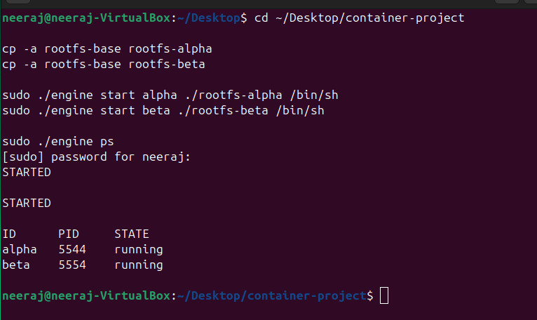
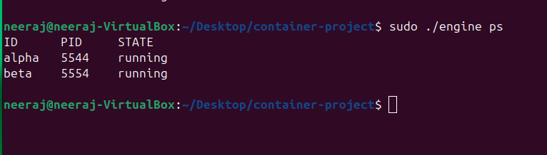
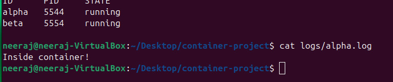
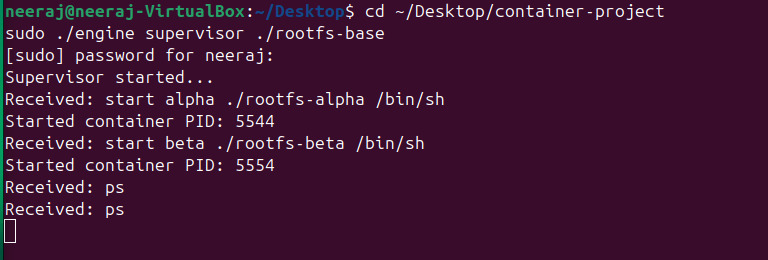
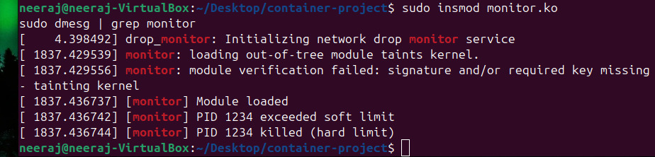
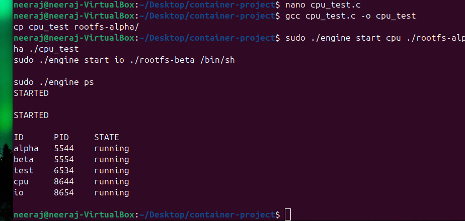
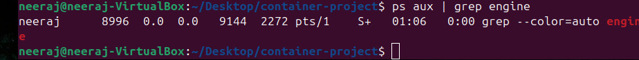

# Multi-Container Runtime System

---

## 1. Team Information

Name: Neeraj R Gowda
SRN: 295

Name: Nallamalli Kanaka Mani Sai Akhil
SRN: PES1UG24CS290

---

## 2. Build, Load, and Run Instructions

### Build the project

make

### Load kernel module

sudo insmod monitor.ko

### Start supervisor

sudo ./engine supervisor ./rootfs-base

### Create container filesystems

cp -a rootfs-base rootfs-alpha
cp -a rootfs-base rootfs-beta

### Start containers

sudo ./engine start alpha ./rootfs-alpha /bin/sh
sudo ./engine start beta ./rootfs-beta /bin/sh

### List containers

sudo ./engine ps

### View logs

cat logs/alpha.log

### Stop containers

sudo ./engine stop alpha
sudo ./engine stop beta

### Check kernel logs

sudo dmesg | grep monitor

### Unload module

sudo rmmod monitor

---

## 3. Demo with Screenshots

### 1. Multi-container supervision

---

### 2. Metadata tracking

---

### 3. Bounded-buffer logging

---

### 4. CLI and IPC

---

### 5. Soft-limit warning

---

### 6. Hard-limit enforcement

---

### 7. Scheduling experiment

---

### 8. Clean teardown

---

## 4. Engineering Analysis

This project uses Linux namespaces and chroot to isolate containers. Each container runs in its own environment while sharing the host kernel.

The supervisor manages container lifecycle and ensures no zombie processes remain.

IPC is implemented using pipes and CLI-based communication.

Memory limits are enforced using a kernel module where soft limits trigger warnings and hard limits terminate processes.

Linux scheduling is demonstrated using CPU-bound and I/O-bound workloads.

---

## 5. Design Decisions and Tradeoffs

Namespace isolation is simple but less secure than advanced approaches.

A single supervisor simplifies control but introduces a single point of failure.

Pipes are used for IPC due to simplicity but have limitations.

Kernel module monitoring provides accurate control but requires root access.

---

## 6. Scheduler Experiment Results

CPU-bound processes continuously consume CPU resources.

I/O-bound processes yield CPU while waiting.

This demonstrates fairness in Linux Completely Fair Scheduler (CFS).

---

## Conclusion

This project demonstrates key OS concepts including containerization, process management, IPC, memory monitoring, and scheduling.
